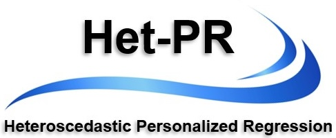

<p align="center">
  
</p>

---

# Het-PR: Heteroscedastic Personalized Regression

Implementation of the Heteroscedastic Personalized Regression (Het-PR) model in the paper:

**Jiahui Zhang, Ziyu Yu, Xingcai Zhang, Haohan Wang. Stratifying Alzheimer’s Disease by Patient-Specific Genetic Signatures Reveals Cognition-Linked and Cross-Disease Heterogeneity.**  
*Manuscript submitted.*

---

## Introduction

Het-PR (Heteroscedastic Personalized Regression) is a personalized regression framework for high-dimensional genomic data.  
The method models individual-specific genetic effects through a heteroscedastic linear mixed model, enabling stable inference of personalized SNP relevance patterns without fitting separate regressions for each subject.

This repository provides the **model implementation and data processing pipeline only**.

---

## Replication

This repository is intended to guide users in applying the Het-PR model to their own GWAS data.  
Scripts for reproducing all experimental results in the manuscript are maintained separately.  
If you are interested in replication, please contact the authors.

---

## File Structure

```
models/        core Het-PR model implementation
runHetPr.py    main entry point for preparing data and fitting Het-PR
setup.py       package installation script
```

- `models/personalizedModel.py`: main Het-PR model  
- `models/LMM.py`: linear mixed model backend  
- `models/BaseModel.py`: variance modeling utilities  

---

## An Example Command

Fit Het-PR on a prepared dataset:

```bash
python runHetPr.py fit -t csv -n data/toy
```

or using NumPy arrays:

```bash
python runHetPr.py fit -t npy -n data/toy
```

---

## Data Support

Het-PR currently supports:

- CSV formatted data  
- Binary PLINK GWAS files (`.bed/.bim/.fam`) through the built-in preparation pipeline  

Additional data formats can be supported by extending the data loading components in `runHetPr.py`.

---

## Installation (Not Required)

You will need `numpy`, `scipy`, and `scikit-learn` installed.

Install via pip:

```bash
pip install git+https://github.com/zjh688/Het-PR
```

Or clone and install manually:

```bash
git clone https://github.com/zjh688/Het-PR
cd Het-PR
python setup.py install
```

---

## Python Users

Advanced Python users may directly import and use the Het-PR model:

```python
from models.personalizedModel import PersonalizedThroughMixedModel
```

See `runHetPr.py` for a complete usage example.

---

## Contact

Haohan Wang  
Carnegie Mellon University  

Implementation and pipeline support:  
Jiahui Zhang
